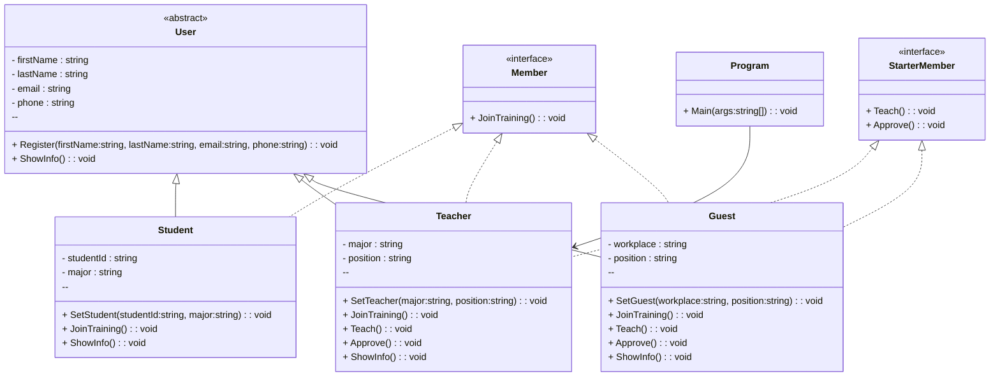

```mermaid
classDiagram
direction TB


class User {
    <<abstract>>
    - firstName : string
    - lastName : string
    - email : string
    - phone : string
    --
    + Register(firstName:string, lastName:string, email:string, phone:string) : void
    + ShowInfo() : void
}


class Member {
    <<interface>>
    + JoinTraining() : void
}

class StarterMember {
    <<interface>>
    + Teach() : void
    + Approve() : void
}


class Student {
    - studentId : string
    - major : string
    --
    + SetStudent(studentId:string, major:string) : void
    + JoinTraining() : void
    + ShowInfo() : void
}

class Teacher {
    - major : string
    - position : string
    --
    + SetTeacher(major:string, position:string) : void
    + JoinTraining() : void
    + Teach() : void
    + Approve() : void
    + ShowInfo() : void
}

class Guest {
    - workplace : string
    - position : string
    --
    + SetGuest(workplace:string, position:string) : void
    + JoinTraining() : void
    + Teach() : void
    + Approve() : void
    + ShowInfo() : void
}

class Program {
    + Main(args:string[]) : void
}


User <|-- Student
User <|-- Teacher
User <|-- Guest

Member <|.. Student
Member <|.. Teacher
Member <|.. Guest

StarterMember <|.. Teacher
StarterMember <|.. Guest

Program --> Teacher
```
